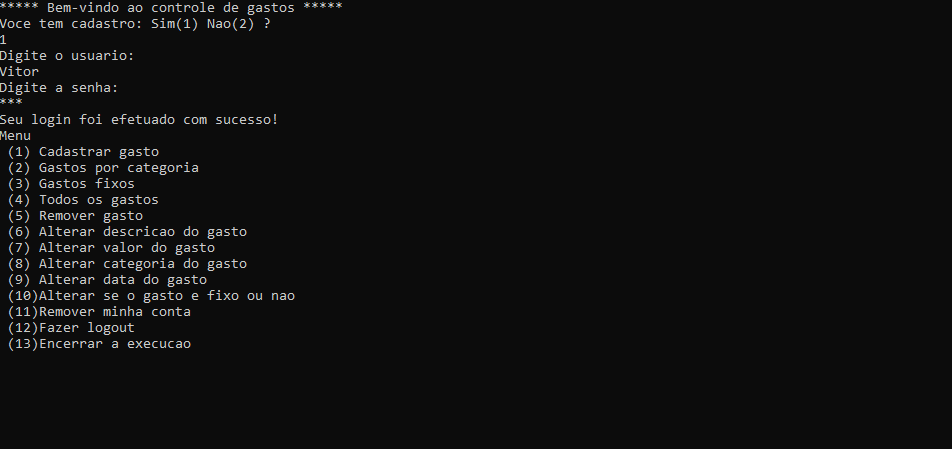

# Aplicação para controle de gastos pessoais

## 📖 Descrição

Esse projeto se refere a uma aplicação MVP simples de controle de gastos pessoais que usa arquivos txt para persistência dos dados dos usuários e dos gastos.

## 🛠️ Funcionalidades

- Cadastro e remoção de usuários
- Cadastro, atualização e remoção de gastos
- Fazer logout
- Exibição de todos os gastos ou por categoria

## 📡 Tecnologias utilizadas

 

  

  

## ⏳ Inicialização

Esse projeto foi desenvolvido utilizando a linguagem de programação [C](https://www.gnu.org/software/gnu-c-manual/gnu-c-manual.html) sem o uso de bibliotecas externas.

## 🤵🤵‍♀️ Colaboradores

Os colaboradores desse projeto foram eu (Eduardo Vítor) e [Bruno Sérgio](https://github.com/bruunosergio).

 

## 🔎 Status do Projeto

 

## 📑 Referências

[C](https://www.gnu.org/software/gnu-c-manual/gnu-c-manual.html)

